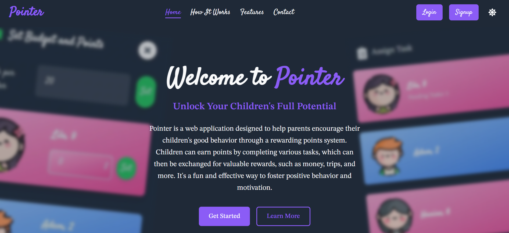
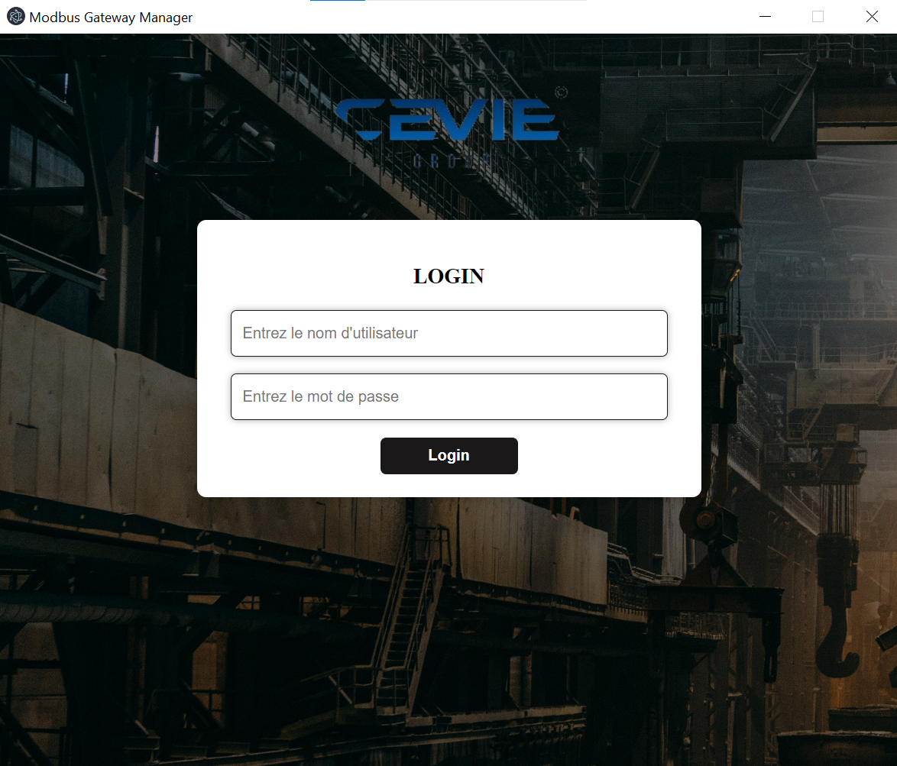
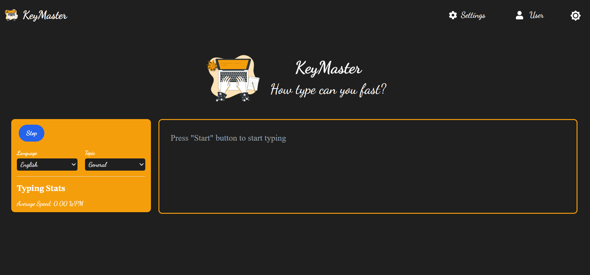

# Ahmed Drioueche's Portfolio

## Welcome to My Portfolio

### About Me
I am Ahmed Drioueche, a Computer Engineering graduate from the Institute of Electric and Electronic Engineering in Algeria. I graduated in 2024 and have over 5 years of experience in programming, with over 2 years focused on web development. Coming from the world of electronics, I have acquired the fundamentals that enable me to work on complex and exciting projects.

---

## Projects

### 1. [Pointer](https://pointer-app.vercel.app)
**Rank:** 3  
**Tech Stack:** Next.js, TypeScript, TailwindCSS, NextAuth, PostgreSQL, Prisma, Supabase, Nodemailer, Gemini, Stripe, Bcrypt, REST APIs, Vercel.

**Description:**  
An engaging web application designed to promote positive behavior in children through a fun and interactive reward system, encouraging discipline and personal growth.

#### Key Features
- Create routines and tasks for children.
- Assign rewards, challenges, and quizzes.
- Secure authentication via Google OAuth with email verification.
- User-friendly child profile dashboards.

**[View on GitHub](https://github.com/ahmedrioueche/pointer)**

---

### 2. [Modbus Gateway Manager](https://github.com/ahmedrioueche/modbus_gateway_manager)
**Rank:** 4  
**Tech Stack:** Electron.js, JavaScript, Node.js, CSS, SQLite, Bcrypt, SerialPort.

**Description:**  
A desktop application for configuring and diagnosing a Modbus gateway, part of my master's graduation project supervised by Cevie Doofas Innovative Solutions.

#### Key Features
- Configure Modbus modes (RTU or TCP).
- Diagnostics for packets traveling through the gateway.
- User settings stored in a local SQLite database.

**[View on GitHub](https://github.com/ahmedrioueche/modbus_gateway_manager)**

---

### 3. [KeyMaster](http://keymaster-type.vercel.app)
**Rank:** 2  
**Tech Stack:** Next.js, TypeScript, React.js, TailwindCSS, Prisma, PostgreSQL, Supabase, Pusher, Bcrypt, Gemini, REST APIs, Vercel.

**Description:**  
A lightweight, responsive web app designed for typing practice with a built-in leaderboard and real-time competition.

#### Key Features
- Real-time typing challenges.
- Customizable settings stored in Supabase.
- User-friendly interface for accessing typing practice sessions.

**[View on GitHub](https://github.com/ahmedrioueche/keymaster)**

---

### 4. Beam (Ongoing)
**Rank:** 1  
**Tech Stack:** Next.js, TypeScript, React.js, Redux, NextAuth, TailwindCSS, Prisma, PostgreSQL, Neon, Pusher, LiveKit, Bcrypt, Gemini, REST APIs, Vercel.

**Description:**  
A fully responsive live streaming platform that leverages LiveKit for streaming functionality and Pusher for real-time chat.

#### Key Features
- User-friendly navigation for current streams.
- Follow and recommend streamers.
- Engaging user experience.

---

## Contact
For any inquiries or collaboration opportunities, feel free to reach out:

- **Email:** [adsrahmed@gmail.com]
- **LinkedIn:** ["https://linkedin.com/in/ahmed-drioueche-aa02732b7"]

Thank you for visiting my portfolio!
